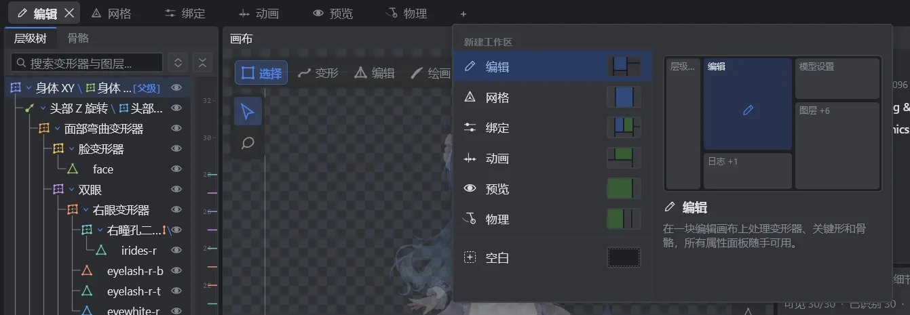

# User quick reference

[Documentation](../../README.md) · [中文](../../zh/guide/USER_GUIDE.md) · [日本語](../../ja/guide/USER_GUIDE.md)

Open **Help → Tutorials…** (`F1`) first. Interactive lessons highlight the controls and show your configured shortcuts. This page is a short companion, in the same lesson order.

## Basic workflow

Import PSD (`Ctrl+Shift+O`) → inspect classifications and preview → edit → save (`Ctrl+S`) → export (`Ctrl+G`). Open an existing `.psd2live` project with `Ctrl+O`.

## Workspaces

The UI is organized into workspace tabs, each with its own canvases and panel layout. Click **+** at the end of the tab bar to add one from six presets or a blank layout; the right side previews the layout and its purpose. The screenshot shows the Chinese UI.

| Preset | Use |
| --- | --- |
| Edit | One edit canvas for deformers, keyforms and bones, with all property panels |
| Mesh | Hierarchy, edit canvas and Mesh panel for mesh topology |
| Rigging | Edit canvas beside a live preview, with the Parameters panel docked |
| Animation | Motion list, preview canvas and animation editor |
| Preview | Large preview with only the motion list |
| Physics | Preview canvas with Parameters and Physics panels, to tune while moving the model |
| Blank | Empty dock; add canvases and panels from the **Windows** menu |

**Reset layout** restores the current workspace's preset layout.

## Tutorial paths

The catalog has 18 topics. The beginner path contains the 17 lessons below; the experienced path starts with a Cubism-to-PSD2Live terminology bridge and skips selected introductory lessons.

| Lesson | Topic | Remember |
| --- | --- | --- |
| 1 | Basic workflow | Import layered artwork, inspect parts and settings, then choose export formats. |
| 2 | Workspace | Edit changes the model; Preview shows it; History restores versions. Each canvas tab has its own camera and overlays. |
| 3 | Hierarchy and mode bar | Select, search and reparent objects. Drop transparent artwork on the tree and confirm placement. Drawing order and parent deformation are different. |
| 4 | Layer types and variants | Presets apply part algorithms; toggle variants show/hide; exclusive variants share a parameter with different association IDs. |
| 5 | Parameters and keyforms | Drag sliders or XY controls; right-click a key mark to snap. Move to the target key before editing its keyform. |
| 6 | Select mode | Select objects with the canvas tools or hierarchy; selection alone changes no geometry. |
| 7 | Create deformers | Select a target, use the tree context menu, adjust the placement preview and confirm. |
| 8 | Deform mode | Edit points or use brushes at the current parameter pose; check the L1 / L2 editing level. |
| 9 | Edit mode | Subdivide, connect, cut or remove mesh elements; inspect existing poses afterward. |
| 10 | Paint mode | Select a layer, paint pixels and use session-local undo. Apply or discard the session. |
| 11 | Inspector | Edit properties for the selected object: name, ownership, masks, drawing order, opacity and colors. |
| 12 | Tool details | Configure the current tool; canvas context menus also change with mode and tool. |
| 13 | Skeleton rigging and posing | Build chains, bind ArtMeshes, inspect weights and pose with IK. Export bakes this PSD2Live authoring aid into Cubism parameters, deformers and corrective keyforms. |
| 14 | Animation editor | Edit parameter tracks and keyframes on the timeline, choose interpolation and preview the motion. |
| 15 | Physics canvas | Configure inputs, pendulums and outputs, then calibrate output scale against the observed range. |
| 16 | Project and history | Save the project, restore a history node or branch from it. Hiding a branch does not delete it. |
| 17 | Texture upscaling | Configure the local backend, choose 2× / 4× and check edges, transparency and exports. |

## Important distinctions

- Saving preserves artwork, edits and history. Exporting delivers model files. `.psd2live.json` is only a report.
- Parameter keyforms belong to modeling and interpolate model shapes. Animation keyframes record parameter values at points in time.
- Deform changes shapes; Edit changes mesh structure; Paint changes pixels in an isolated apply/discard session.
- Temporary solo visibility and static visibility are not parameter-driven variants. Use variants or opacity keyforms for animated switches.

## Default shortcuts

These are the default (Photoshop-style) bindings. **Settings** can switch to Blender- or Cubism-style presets or rebind individual actions; **Help → Keyboard Shortcuts…** shows the current bindings.

| Action | Keys |
| --- | --- |
| Open project / import PSD | `Ctrl+O` / `Ctrl+Shift+O` |
| Save / save as | `Ctrl+S` / `Ctrl+Shift+S` |
| Undo / redo | `Ctrl+Z` / `Ctrl+Shift+Z` or `Ctrl+Y` |
| Export model / export PSD | `Ctrl+G` / `Ctrl+Shift+E` |
| Reanalyze PSD | `Ctrl+R` |
| Texture upscale | `Ctrl+U` |
| Tutorials | `F1` |
| Zoom / pan | Wheel / middle drag or Space + left drag |
| Frame selection / reset camera | `F` / `Home` or `0` |
| Confirm / cancel | `Enter` / `Esc`; the current tool shows its own gestures |

## Troubleshooting

| Symptom | Check first |
| --- | --- |
| A part moves wrongly or not at all | [Layer naming](../spec/PSD_LAYER_SPEC.md) and the type and side in the Layers table; masks and parents |
| Static poses look right but motion breaks | Play it in the animation or physics panel; one static pose does not show dynamic behavior |
| A panel is missing | Panel toggles in the Windows menu, or Reset layout at the top right |
| The model is not visible | Fit the canvas (`F` / `Home`), then check layer visibility |
| Export fails or reports downgrades | The Log panel, the `.psd2live.json` report and the export target version |

Further reading: [SDK setup](CUBISM_SDK_SETUP.md), [development and CLI](DEVELOPMENT.md), [project format](../spec/PROJECT_FORMAT.md), and the Chinese references for [canvas editing](../../zh/guide/CANVAS_EDITOR.md), [paths](../../zh/guide/DEFORM_PATHS.md), [upscaling](../../zh/guide/TEXTURE_UPSCALE.md) and [MCP](../../zh/agent/MCP_AUTHORING.md).

Maintained against the [tutorial catalog](../../../src/main/kotlin/io/github/psd2live/ui/tutorial/InteractiveTutorial.kt) and [shortcut registry](../../../src/main/kotlin/io/github/psd2live/ui/state/ShortcutRegistry.kt).
